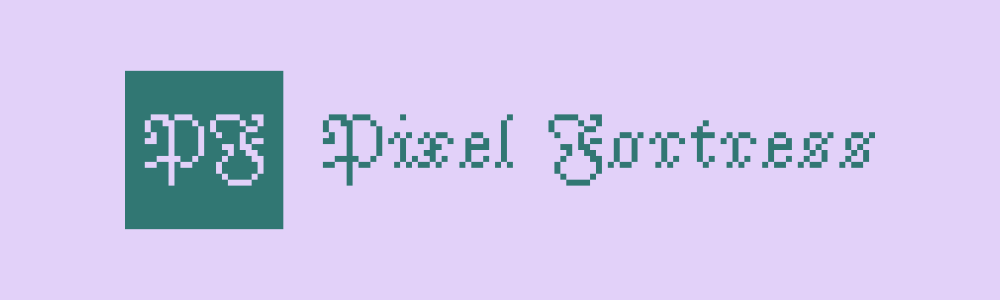

 

#  Pixel Fortress

A 2D pixel-based strategy game that uniquely merges the depth of Tower Defense with the addictive simplicity of Clicker styles.

➡️ [Play live](https://dorianbayart.github.io/sandbox/games/pixel-fortress/)

## ✨ Features

* **Strategic Gameplay:** Build up your Fortress to produce units and defend your fortress against enemies.
* **Dynamic Map:** Explore huge randomly generated maps with various terrains and obstacles.
* **Unit Management:** Control multiple units with unique abilities and stats.
* **Zoom:** Use the mouse wheel to zoom in and out for a detailed view of the battlefield.
* **Pathfinding:** Units intelligently navigate the map to reach their destinations.

## 🎮 Game Modes

**Single-player (vs AI):** Currently, the game can be played against an AI opponent. This mode allows you to practice and familiarize yourself with the game mechanics, through campaigns, and predefined or randomly generated maps.

**Multiplayer (vs Player):** Multiplayer functionality will hopefully be added in a future release. This will allow you to play against other players online and compete for dominance on the battlefield.  
Stay tuned for updates! 

## 💻 Technologies Used

* **HTML/2D Canvas:** Provides the structure and visuals of the game.
* **JavaScript:** Handles game logic, rendering, and player interactions.
* **Pixi.js:** Used for rendering, animation and in-game UI.
* **Web Workers:** To enhance performance, the pathfinding calculations are offloaded to a web worker thread.

## 🕹️ Game Mechanics (Brief Overview)

* **Unit Management**  
In Pixel Fortress, you build structures that automatically produce units. These units operate independently, with some dedicated to resource gathering (food, wood, gold, stone, whatever) and others focused on combat against enemy units and structures. You don't directly control individual units; instead, you manage your resource production and building placement to optimize your unit's effectiveness.  
The AI opponent uses the same automated unit management system.

* **Attack**  
Units automatically attack nearby enemies within their range or navigate to engage them.

## 🚀 Getting Started

### ✅ Prerequisites

* A modern web browser (such as Chrome)

### 💾 Installation

1. Clone the repository: `git clone https://github.com/dorianbayart/sandbox.git`
2. Navigate to the project directory: `cd games/pixel-fortress`

### ▶️ Running the Game

1. Open the `index.html` file in your web browser.
2. Enjoy!

### ⚠️ Troubleshooting

* **Game Doesn't Load:** Ensure you have properly cloned the repository.
* **Performance Issues:** Try closing other browser tabs or applications to free up system resources.
* **Unexpected Behavior:** If you encounter bugs or glitches, please report them on the project's issue tracker. Please remember it is still a work in progress.

## 🎯 Roadmap

Here's a look at the planned features and improvements:

1. **Enhanced AI:** Improve the AI opponent's decision-making and strategic capabilities.
2. **Multiplayer Support:** Implement online multiplayer functionality for player-versus-player battles.
3. **Campaign Mode:** Create a single-player campaign with a series of missions and objectives.
4. **New Units and Buildings:** Introduce new unit types and buildings with unique abilities and roles.
5. **Advanced Resource Management:** Expand resource gathering and management systems with new resources and strategies.
6. **Terrain and Environment Effects:** Add more diverse terrain types and environmental elements that impact gameplay.
7. **Improved Graphics and Animations:** Enhance the visual fidelity of the game with better sprites and animations.
8. **Sound Effects and Music:** Integrate sound effects and music to create a more immersive experience.
9. **User Interface Enhancements:** Improve the user interface for better clarity and usability.
   
These are just some of the ideas I have in mind, and I am open to suggestions and feedback. 
Stay tuned for updates as I continue to develop and expand Pixel Fortress!

A detailed roadmap can be found here: [ROADMAP.md](ROADMAP.md)

## 🤖 AI Assistant Guidelines

This project includes a `GEMINI.md` file with detailed context for AI code assistants. If you are using an AI to help with development, please ensure it has access to this file to understand the project's conventions and architecture.

## 🙌 Credits

* Very useful SVG icons: [Pixel Icon Library](https://github.com/hackernoon/pixel-icon-library)
* Main game assets: [Puny World from Merchant-Shade](https://merchant-shade.itch.io/16x16-puny-world)
* Original game assets: [Mini World from Merchant-Shade](https://merchant-shade.itch.io/16x16-mini-world-sprites)

## 📜 License

This project is licensed under the **Creative Commons Non-Commercial 4.0 International License**.

This means you are free to:

* **Share** — copy and redistribute the material in any medium or format
* **Adapt** — remix, transform, and build upon the material

Under the following terms:

* **Attribution** — You must give appropriate credit, provide a link to the license, and indicate if changes were made. You may do so in any reasonable manner, but not in any way that suggests the licensor endorses you or your use.
* **Non-Commercial** — You may not use the material for commercial purposes.
* **No Additional Restrictions** — You may not apply legal terms or technological measures that legally restrict others from doing anything the license permits.

**Full License Text:** [https://creativecommons.org/licenses/by-nc/4.0/](https://creativecommons.org/licenses/by-nc/4.0/)

## #️⃣ Keywords

pixel, fortress, game, strategy, tower defense, TD, clicker, pixel art, 2D, HTML5, JavaScript, canvas, web, browser, open source, sandbox, dungeon, monsters, waves, upgrades, skills, achievements, resource management, base building, survival
